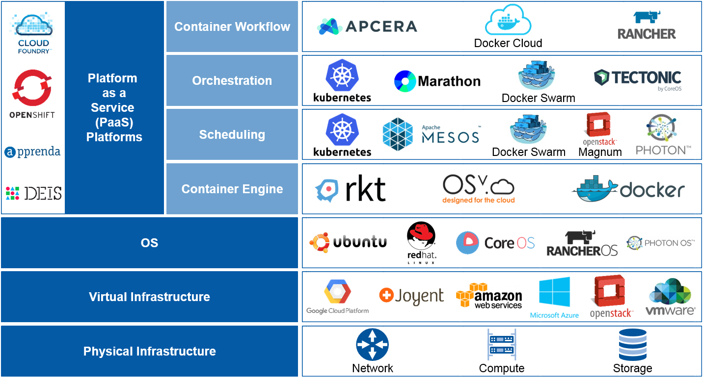
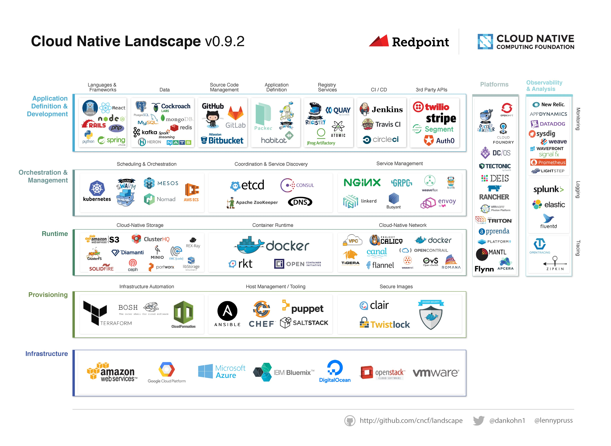

#Source Code Management

---

# Why use version control

 - Version control records changes that are made so you can recall specific version later
 - Makes it possible for you to work on a feature/bug fix/release without changing production code
 - No more "file-version3.py" or "config-020315.conf"!
 - Since everything is pure text it's easy to "merge" new code into existing

---

# Git

A distributed version control system, where every user has a complete and full copy of the source code.  

If you can't check it in, you can't keep track of it, so you can't version it, so you can't automate it.

*Everything* belongs in source code control, and git is the standard in 3rd platform.

Other possible options: subversion (svn), mercurial (hg), Perforce (p4), ClearCase (cc).

---

#GitHub

A freemium service to host Git repositories (repos). Public repos are free, private ones are still cheap.

Most open source projects are hosted and collaborated on here.

> If you're not on GitHub you don't exist.
-- Friendly developer

---

#Using Git

(you have `git` installed, right?  It was in the prework!)

---

#Clone A Repo

`git clone https://github.com/ArronP/AJ_Test_Repo.git`

Now, explore that repo folder:

* `cd foo` = change to director `foo`
* `cd ..` = move up to parent directory
* `ls` or `dir` = show the directory contents

---

#Make A Change

Edit a file in notepad or textedit. Save it.

Back in the CLI, run: `git status`

---

#Commit That Change

`git commit -a -m "My Changes Are Awesome"`

---

#Revert that commit

`git reset --soft HEAD~`

---

#Cool!

---

#Infrastructure As Code

##Imagine If:
* Your switches could be updated like that?
* Servers could be deployed like that?
* You didn't write 'as built' documentation, because your code *was* documentation?

---

---

#What is Container in reality?

"An isolated process/set of processes that has its own filesystem and a name space"

---

#What are layers in a Container?

---

#Container vs Images
* A container is a running application (see the def. above)
* You create a container using an image. So think of an image like a recipe.
* You create containers from images

---

#What are the benefits of Containers?

* Solve the "Works On My Machine" problem -> Eliminate environment inconsistencies
* Make installation VERY simple
* Allow for delete and upgrade/Easier rollbacks if needed <- NO OS Maintenance
* Share applications in an easier and faster way
* Open / Secure / Lightweight

---

#Docker: What is this?

Docker is a tool for running, creating, and managing application containers.

---

#What Docker adds

---

#And it is not just about Docker...

---

#Containers **and** VMs

---

# And there is more than just Containers

---

# A whole ecosystem of Tools

---

# With many Players

---

# As seen by Analysts            

Source: Gartner June 2016

---

# And even more complex...

Source: https://github.com/cncf/landscape

---

#Real World

---

#KCG: What Happened

* Manual deployment of new trading software
* 7 of 8 servers correctly updated
* Old function still alive on the 8th server led to…

---

#$440 million loss...
#in 45 minutes
